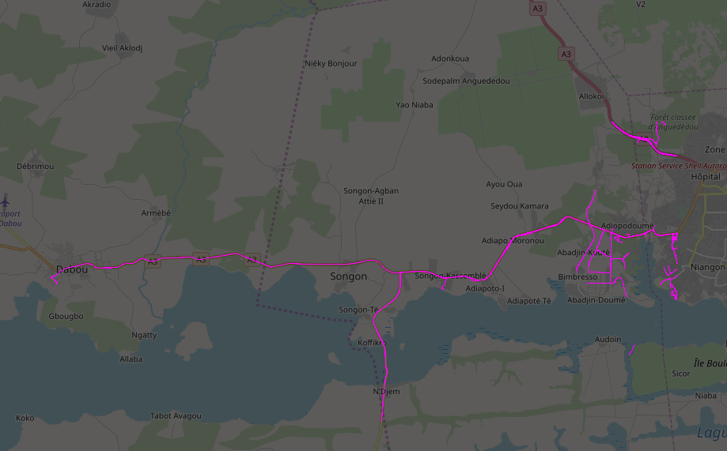
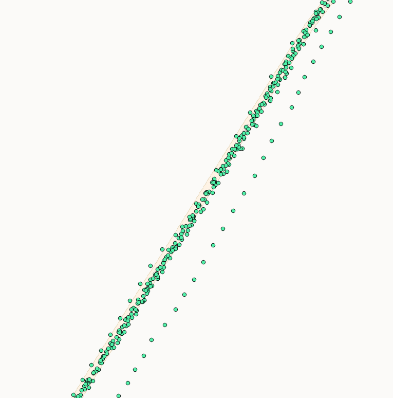
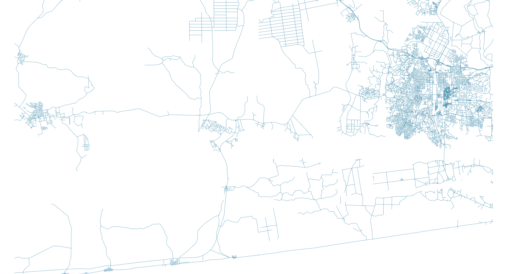
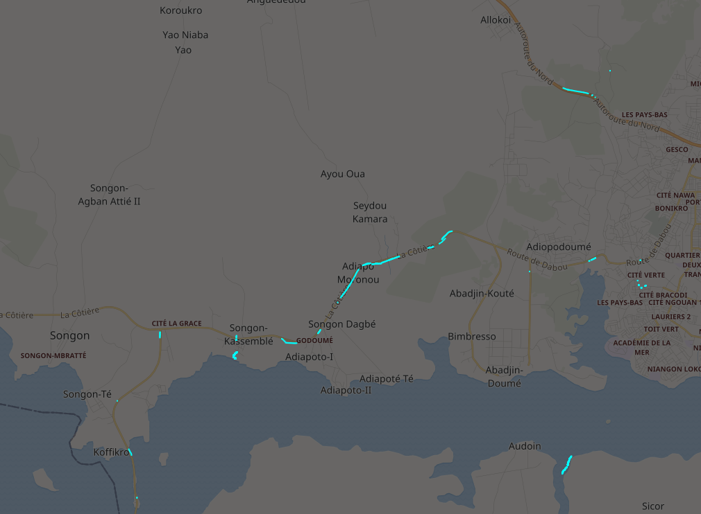
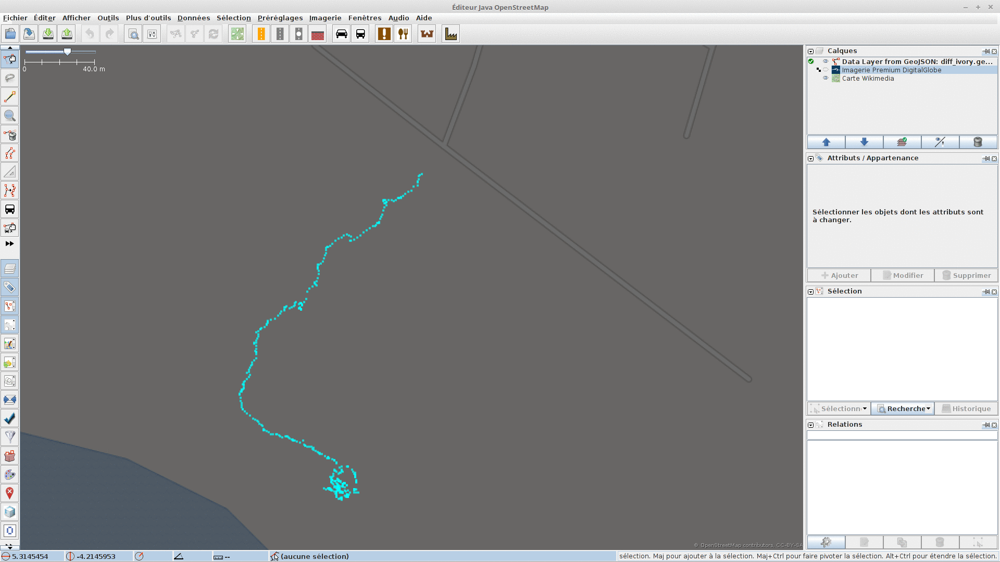
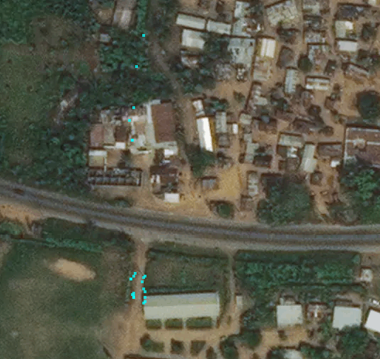

un POC de mapmatching sur des traces GPS pour détecter des routes manquantes


# Préparation des données GPS

On télécharge les traces GPS publiques d'une zone (dans JOSM), et on enregistre en GPX.


Pour ce qui nous intéresse, on peut se contenter des points de la trace (les éléments tracks_points). On extrait ces éléments qu'on convertit en geojson (avec QGIS)


On convertit ça en tuiles vectorielles avec [tippecanoe](https://github.com/mapbox/tippecanoe).
Personnellement, je l'ai installé en docker, donc ça ressemble à ça :
```
docker run -it --rm \
	  -v /chemin_local_où_est_le_fichier_geojson_à_convertir:/data \
	  tippecanoe:latest \
	  tippecanoe --output=/data/traces.mbtiles /data/traces.geojson
```

On a à la fin un fichier `traces.mbtiles`, avec une couche de données "traces_as_points"

# Préparation des données OpenStreetMap

On télécharge le fichier [OSM-QA-Tiles](http://osmlab.github.io/osm-qa-tiles/country.html) (qui contient les objets OSM et leurs tags, déjà en tuiles vectorielles) qui correspond à la zone qui nous intéresse.

On le filtre pour ne garder que les routes et on en profite aussi pour le restreindre géographiquement, avec [mbslice](https://www.npmjs.com/package/mbslice) :

```
mbslice ivory_coast.mbtiles --filters '["has","highway"]' --bbox '[-4.3834083,5.256455,-4.1116333,5.386335]' > source_osm.geojson
```
On reconvertit ça en tuiles vectorielles avec tippecanoe.

NB : Sur une petite zone géographique, il est probablement plus pertinent d'extraire les routes de la zones en geojson et de transformer cela directement en mbtiles.

Admettons qu'à la fin, on a un fichier `source_osm.mbtiles` avec une couche de données "source_osm".

# Vérification visuelles des données

Avant de commencer à comparer ces deux jeux de données, bien vérifier qu'ils sont ok, noter le nom des couches contenus dans les mbtiles, etc



Personnellement, j'utilise tileserver-gl, installé en docker :
```
docker run --rm -it -v $(pwd):/data -p 8080:80 klokantech/tileserver-gl
```

# Extraction des points des traces qui ne sont pas sur des routes dans OpenStreetMap

En utilisant le framework [TileReduce](https://github.com/mapbox/tile-reduce) de Mapbox, et en s'inspirant du [travail réalisé](https://github.com/osmbe/road-completion) par la communauté OSM Belge (merci à eux !):
* on crée un buffer autour de chaque rue d'OSM
* on ne conserve que les points de traces qui ne sont pas dans le buffer

```
node index.js traces.mbtiles source_osm.mbtiles diff.geojson
```

# Analyse des résultats



Idéalement, on utilise l'imagerie aérienne pour challenger les résultats.

Là, il manque en effet un chemin (tout un paté de maisons en fait):



Là aussi :



Là, soit des chemins piétons qui longent la route, soit c'est un faux positif :


